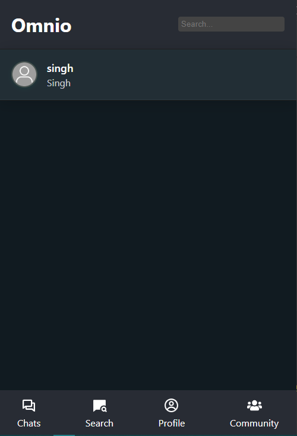
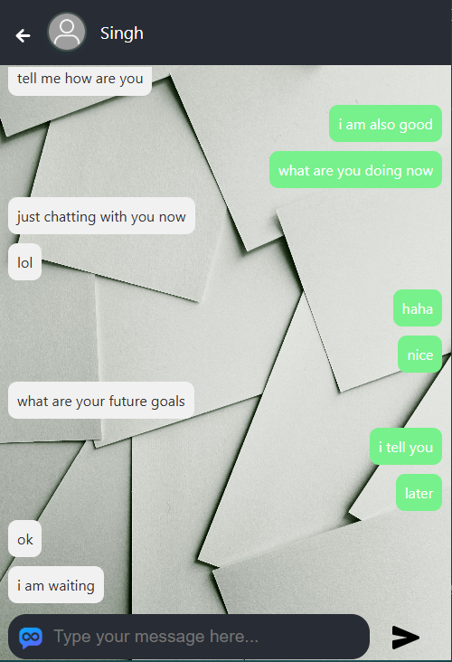
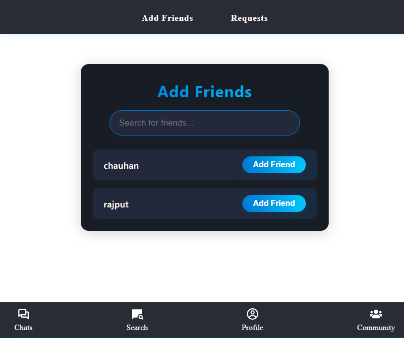
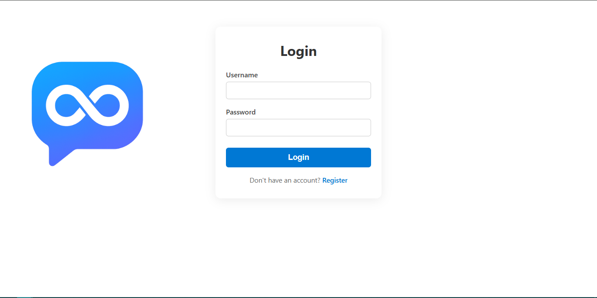

# Omnio Chat App

A modern, real-time chat application designed for seamless communication.

---

## Features

- Real-time messaging
- User authentication
- Group and private chats
- Responsive UI
- Message notifications

---

## Tech Stack

- **Frontend:** React.js
- **Backend:** Node.js / Express.js
- **Database:** MongoDB
- **Real-time:** Socket.io

---

## Getting Started

### Prerequisites

- Node.js (v14+)
- npm or yarn

### Installation

```bash
git clone https://github.com/tejvir21/omnio.git
cd omnio
npm install
```

### Running the App

```bash
npm start
```

---

## Folder Structure

```
omnio/
├── public/
├── src/
|   ├── assets/
|   |   ├── images/
|   |   └── js/
│   ├── components/
|   |   └── styles/
│   ├── pages/
|   |   └── styles/
├── package.json
├── .env
└── README.md
```

---

## Contributing

1. Fork the repository
2. Create your feature branch (`git checkout -b feature/YourFeature`)
3. Commit your changes (`git commit -m 'Add some feature'`)
4. Push to the branch (`git push origin feature/YourFeature`)
5. Open a pull request

---

## License

This project is licensed under the [MIT License](LICENSE).

---

## Contact

For questions or feedback, please open an issue or contact [Portfolio](https://tejvir.netlify.app/).

## Screenshots







